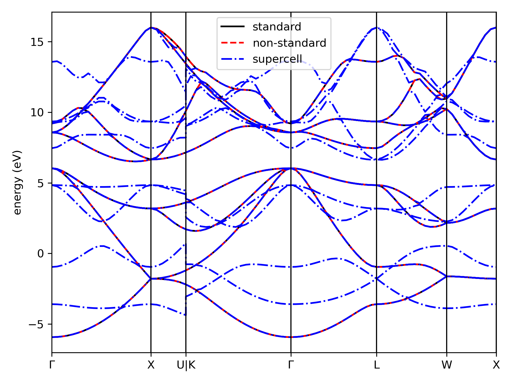

### HOWTO
1. Setup input files by running `kpath.py` (Already done)
2. Run SCF and NSCF calculations using `run.sh`
3. Parse band energies using `bands.x`
4. Plot band structure using `plot.py`

### Example: Silicon

